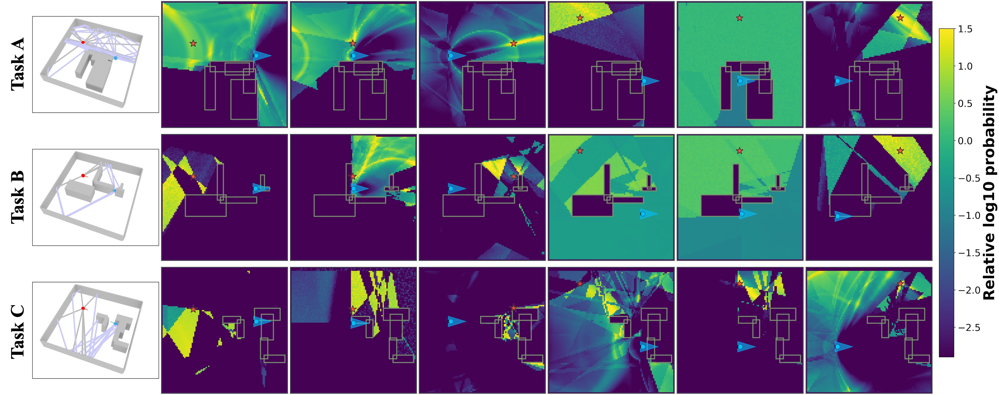

I lead **LOCUS-DT**, a wireless-localization framework that compares an observed multipath snapshot with candidate-specific signatures generated by a ray-tracing wireless digital twin. The learned compatibility scores form a posterior over transmitter location, including multiple plausible modes when the measurement is incomplete or the model is imperfect.

## Observation-conditioned digital-twin inference

For every candidate location, the digital twin supplies the multipath structure that the receiver would expect. LOCUS-DT scores the agreement between those simulated hypotheses and the measured path peaks, then normalizes the scores into a calibrated spatial belief.

  <figure class="project-figure-card">
    
    <figcaption><strong>Journal schematic.</strong> LOCUS-DT matches measured multipath features with candidate-specific ray-traced signatures and converts their learned compatibility into a transmitter-location posterior.</figcaption>
  </figure>

  <figure class="project-figure-card">
    
    <figcaption><strong>Conference evidence.</strong> Experiments across three unseen indoor layouts recover structured, often multimodal posteriors that expose blockage and multipath instead of hiding them behind one coordinate.</figcaption>
  </figure>

The peer-reviewed [IEEE GLOBECOM 2026 paper](https://arxiv.org/abs/2608.00406) establishes LOCUS-DT. The first- and corresponding-author journal extension, [*Site-Agnostic Posterior Inference for Indoor Localization with Ray-Tracing Wireless Digital Twins*](/publications/lei2026twc-siteagnostic-posterior/), studies site generalization and explicit digital-twin mismatch; a revision is in preparation for resubmission to **IEEE Transactions on Wireless Communications (TWC)**.

## Relationship to MC-CLE

LOCUS-DT and [MC-CLE](/projects/mccle-full-posterior-localization/) share a full-posterior localization objective but use complementary models. LOCUS-DT explicitly evaluates observed multipath against ray-traced candidate signatures; MC-CLE learns a measurement-conditioned candidate likelihood. Their common output is calibrated spatial belief that can support localization, multi-view fusion, and active sensing.
