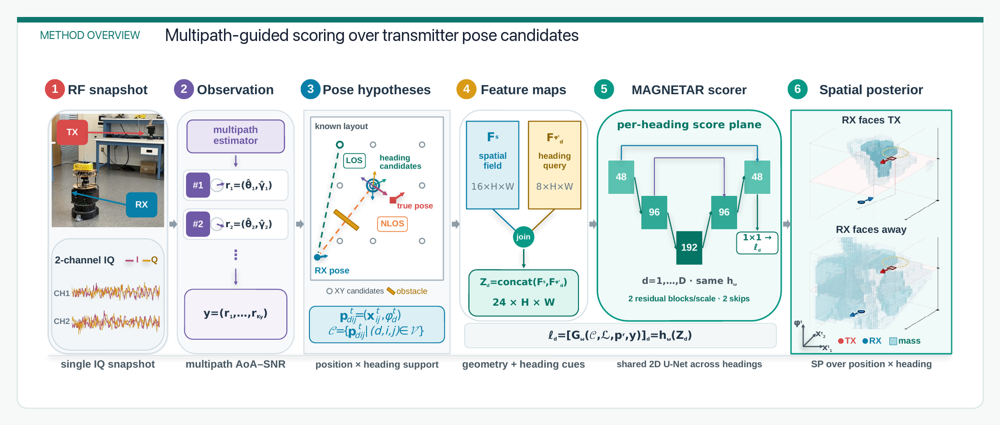
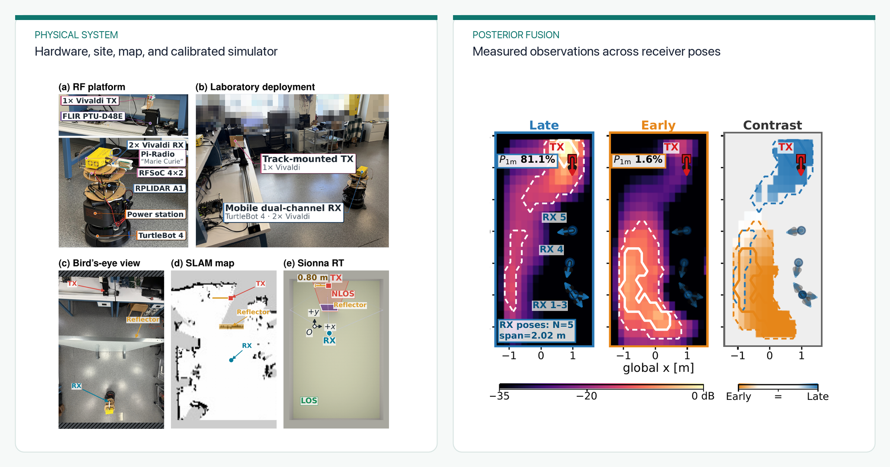

I lead **MAGNETAR** from probabilistic formulation and neural architecture design through real-to-sim calibration, MobiFR3 integration, experiment design, and evaluation. The method estimates a joint posterior over a transmitter's planar position and heading from one asynchronous RF multipath snapshot, rather than forcing an ambiguous observation into a single pose estimate.

  <video controls playsinline preload="metadata" poster="featured.png" aria-describedby="magnetar-video-description">
    <source src="magnetar-demo.mp4" type="video/mp4">
    Your browser does not support embedded MP4 video.
  </video>

<em>The three-minute overview shows why position and heading must be inferred together, how MAGNETAR scores pose hypotheses, and how it is evaluated with robotic measurements.</em>

  <figure class="project-figure-card">
    
    <figcaption><strong>Joint pose inference.</strong> A heading-conditioned spatial scorer preserves competing position and orientation hypotheses rather than collapsing an ambiguous RF snapshot into one estimate.</figcaption>
  </figure>
  <figure class="project-figure-card">
    
    <figcaption><strong>Physical validation and fusion.</strong> MobiFR3 couples 10-GHz measurements with robot poses; evidence from multiple viewpoints is fused to resolve ambiguous transmitter poses.</figcaption>
  </figure>

## Method

- Represents each observation by angle-of-arrival and signal-to-noise-ratio estimates, together with the known room layout and receiver pose.
- Uses a heading-conditioned shared 2D U-Net to score and jointly normalize a discretized position-heading grid.
- Trains primarily in real-to-sim-calibrated 10-GHz simulation, with measured antenna patterns and RF-chain/noise effects, then augments training with 1,800 measured records.
- Fuses joint posteriors across observations so that evidence with incompatible heading hypotheses does not reinforce the wrong position.

## Physical evaluation

The experimental study uses [MobiFR3](/projects/wireless-robotics-platform/), the robotic RF system that I lead. On 24,000 held-out measurements, the heading-conditioned scorer achieved the lowest real-data negative log-likelihood and the highest joint hit rate among the tested models. Student collaborators whom I mentor contributed to RF operation and data acquisition; I led the algorithm, calibration, RF-robot integration, experimental design, and evaluation.

**Paper:** [MAGNETAR: Multipath-Guided Spatial Posteriors for Transmitter Pose Inference in the Upper Mid-Band](https://arxiv.org/abs/2609.20670) — first and corresponding author; IEEE ICRA 2027, under review.
