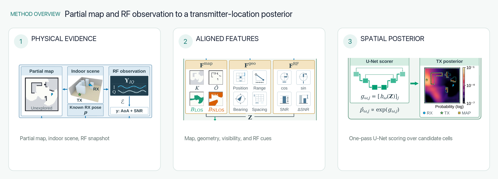
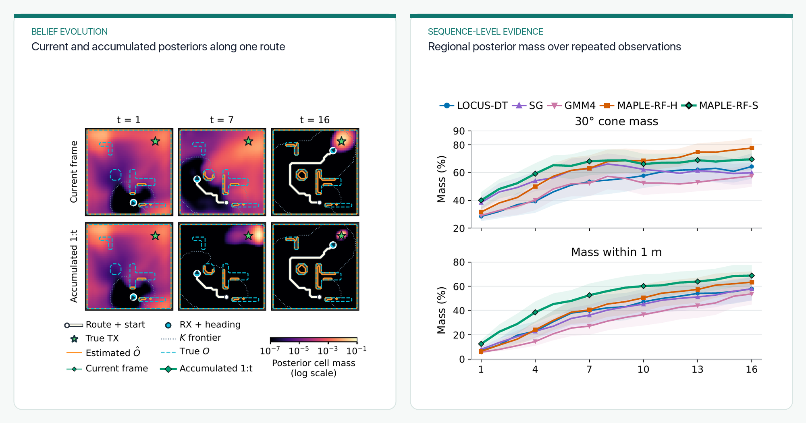

I lead **MAPLE-RF**, an efficient probabilistic RF source-localization method for environments that are still being mapped. The core problem is common in robotic search: a receiver knows its own pose, but most of the surrounding floor plan may remain unobserved, including obstacles that could block or reflect the signal.

  <video controls playsinline preload="metadata" poster="featured.png" aria-describedby="maple-video-description">
    <source src="maple-rf-demo.mp4" type="video/mp4">
    Your browser does not support embedded MP4 video.
  </video>

<em>The simulation follows a receiver along a recorded route while the observed map grows and the transmitter posterior is updated.</em>

  <figure class="project-figure-card">
    
    <figcaption><strong>Inference before the map is complete.</strong> RF paths are aligned with map knownness, occupancy, visibility, receiver pose, bearing, and range before one network pass scores candidate source locations.</figcaption>
  </figure>
  <figure class="project-figure-card">
    
    <figcaption><strong>Belief accumulation during exploration.</strong> Current measurements and accumulated posteriors sharpen the source belief as the receiver moves and the observed map expands.</figcaption>
  </figure>

## Method

MAPLE-RF aligns estimated path angles and SNRs with spatial channels for map knownness, occupancy, line-of-sight visibility, receiver pose, bearing, and range. A residual U-Net then scores every candidate transmitter location in one pass. Unlike a full-grid digital-twin query, inference does not ray-trace every candidate whenever the map or receiver pose changes.

## Findings

- Training across mixed levels of map coverage is essential for localization with unexplored space.
- MAPLE-RF retained about 94% of its complete-map 1-m recall when 75-85% of the map was unobserved.
- Fresh-query inference was about 218 times faster than full-grid general-purpose ray tracing in the evaluated configuration.
- Bayesian accumulation along exploration routes placed more posterior probability near the source than the compared baselines.

The current study is simulation-based. Its role in the broader research program is to make posterior RF localization practical when a robot must localize and map concurrently, before a complete digital twin is available.

**Paper:** [MAPLE-RF: Efficient Probabilistic RF Source Localization in Partially Explored Environments](https://arxiv.org/abs/2609.21026) — first and corresponding author; IEEE ICRA 2027, under review.
