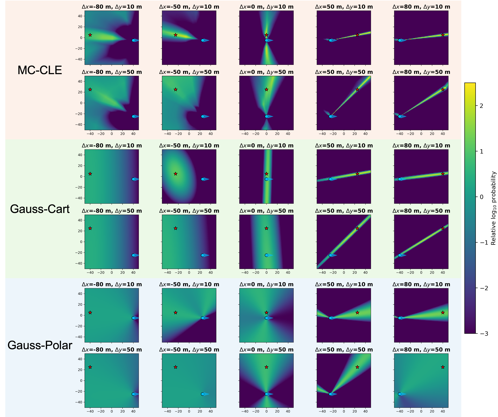

I lead **MC-CLE**, a probabilistic localization method that asks how compatible each candidate transmitter location is with a sparse angle-and-strength measurement. Instead of forcing ambiguous RF evidence into one coordinate, MC-CLE learns a spatial likelihood field that retains directional structure and multiple plausible hypotheses.

## From physical measurement to spatial likelihood

The model conditions candidate-wise scoring on receiver geometry and the measured channel signature. Normalizing the scores over candidate locations yields a full posterior that can be calibrated and fused across measurements.

  <figure class="project-figure-card">
    
    <figcaption><strong>Journal schematic.</strong> Scene geometry, receiver pose, and the RF channel signature condition a learned candidate scorer, producing a full spatial posterior rather than a single estimate.</figcaption>
  </figure>

  <figure class="project-figure-card">
    
    <figcaption><strong>Conference evidence.</strong> Across varied transmitter-receiver geometries, MC-CLE preserves directional and multimodal posterior structure that Gaussian point-error models smooth away or constrain incorrectly.</figcaption>
  </figure>

The peer-reviewed [Asilomar 2026 paper](https://arxiv.org/abs/2509.25719) introduces likelihood-based full-posterior localization. The first- and corresponding-author journal extension, [*Learning a Measurement-to-Posterior Map for Wireless Localization*](/publications/lei2025-likelihoodposterior-wirelessloc/), is under review at **IEEE Transactions on Vehicular Technology (TVT)**.

## Relationship to LOCUS-DT

MC-CLE and [LOCUS-DT](/projects/locus-dt-digital-twin-localization/) address the same full-posterior localization objective through complementary model classes. MC-CLE learns a measurement-conditioned candidate likelihood, while LOCUS-DT explicitly compares observations with ray-traced candidate signatures. Both provide calibrated spatial belief as an interface to downstream localization and autonomous sensing.
