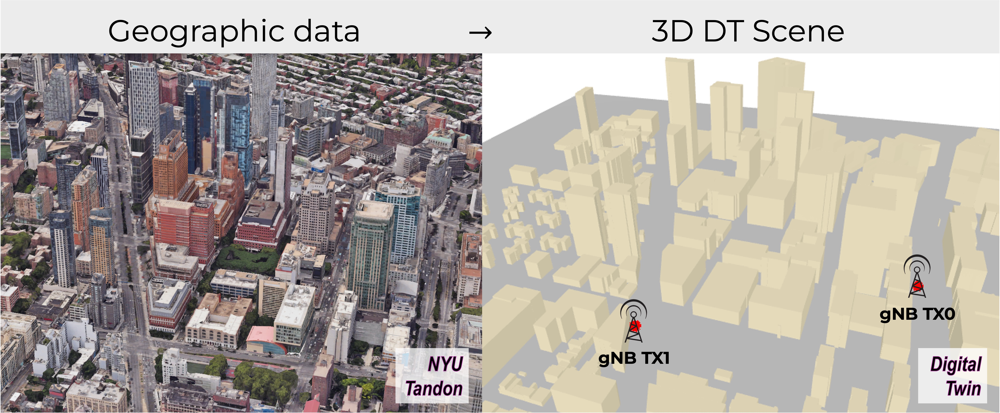
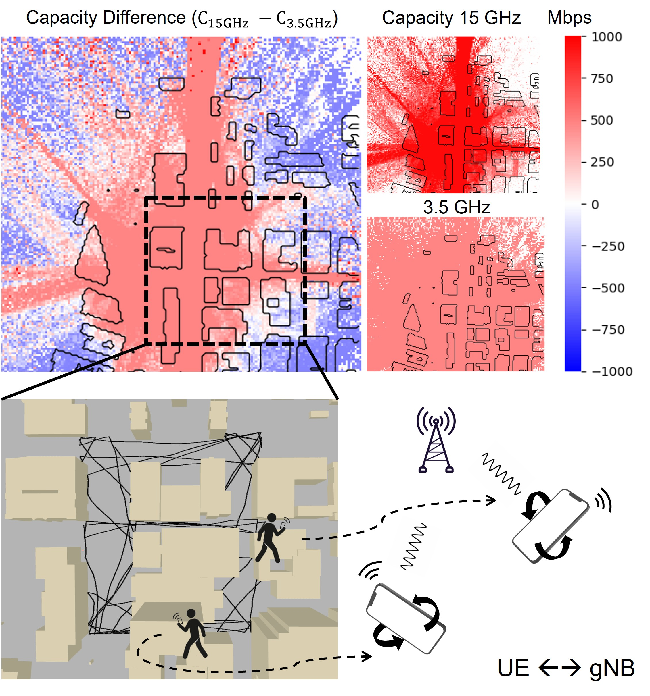
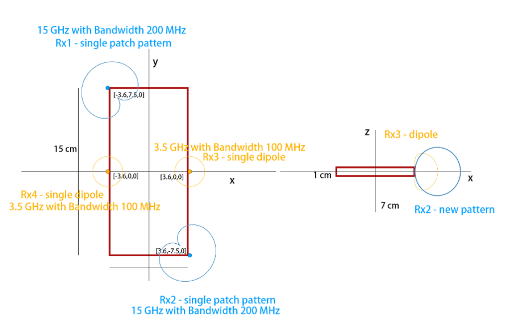
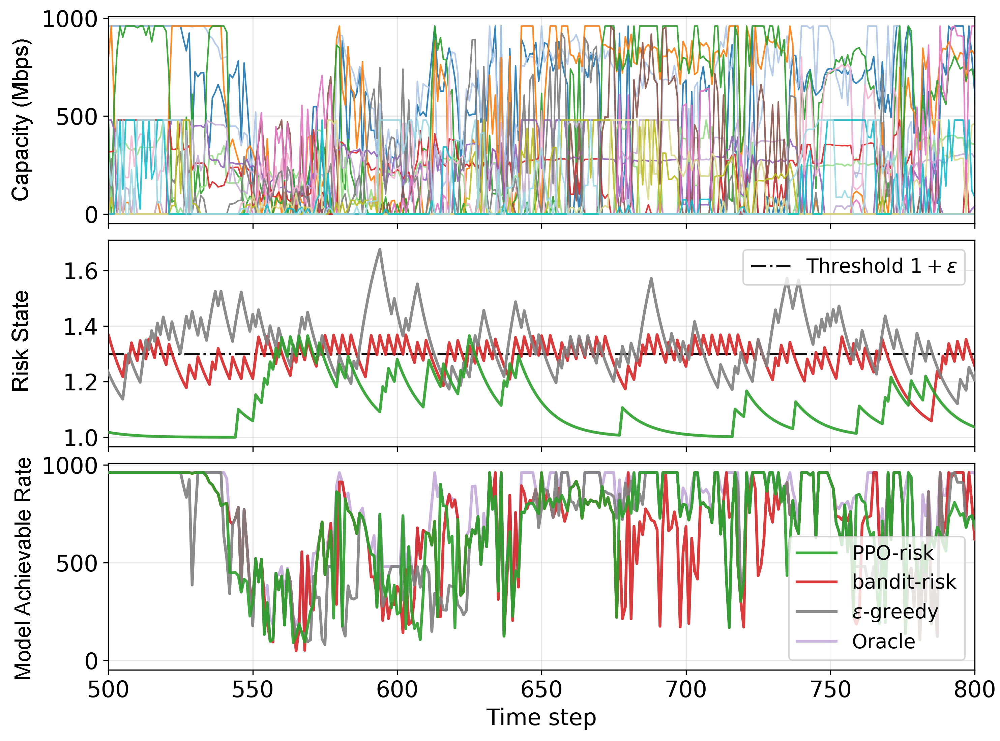

I am developing **MCMB-HDT** (Multi-Cell Multi-Band Handset Digital Twin), a UE-centric framework that couples real urban geometry, base-station topology, FR1/FR3/mmWave ray tracing, embodied handset antenna radiation, pedestrian motion, handset pose, and measurement-limited feedback. On top of this twin, we study Transformer-based rate prediction from sparse asynchronous histories and PPO-based power-aware array/band activation under rate, power, and exploration constraints.

*This figure shows how geographic data are converted into a 3D digital-twin scene for multi-band ray-tracing simulation.*

*The capacity maps illustrate why the best band and antenna choice changes with location, handset pose, and pedestrian mobility.*

*The UE layout defines the active antenna elements and frequency bands used by the prediction and activation policies.*

*The policy result summarizes the tradeoff between exploration risk and achievable rate when the handset activates only a subset of arrays and bands.*

**Related papers**
- [Transformer-Based Rate Prediction for Multi-Band Cellular Handsets](https://arxiv.org/pdf/2509.25722) (IEEE ICC Workshops 2026)
- MCMB-HDT: A Multi-Cell Multi-Band Handset Digital Twin for Learning-Based Closed-Loop Array Activation (IEEE JSAC, under review)
