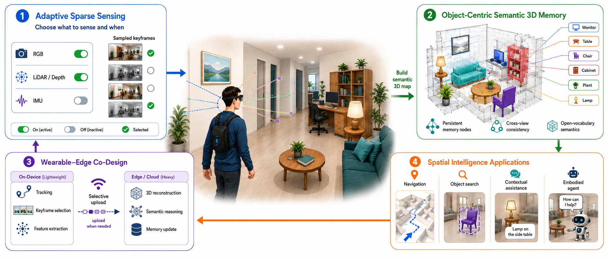
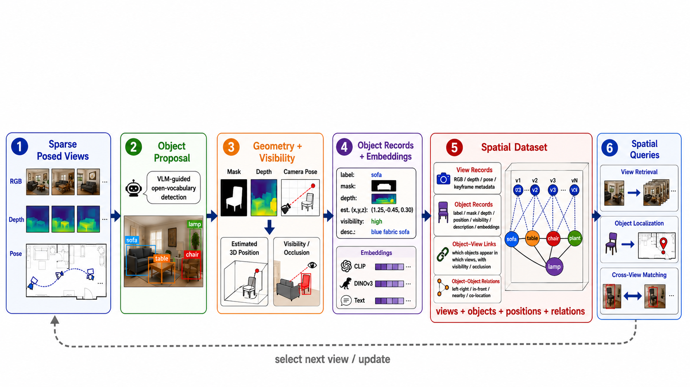

I mentor two M.S. students on an exploratory object-centric RGB-D spatial-memory project for wearable and embodied agents. The pipeline converts selected egocentric RGB, depth, and pose observations into localized object records, allowing retrieval and spatial queries without treating every frame as a dense map. This direction complements my RF work through the shared problems of partial observability, spatial belief, and selective sensing, but it is not presented as a mature publication line.

*The system joins adaptive sensing, persistent open-vocabulary memory, wearable-edge co-design, and downstream spatial-intelligence tasks.*

*The dataset links sparse posed views, geometry, visibility, object records, embeddings, and object relations to support retrieval, localization, cross-view matching, and selective next-view updates.*

**Current pipeline**
- Sparse Habitat/HM3D or egocentric exploration with VLM-guided object-category selection.
- YOLO-World detection, NanoSAM masks, DepthPro depth, field-of-view geometry, and visibility-aware object scoring.
- Batched or crop-level object VLM descriptions, CLIP/DINOv3 embeddings, and cross-view association.
- Queryable object records with labels, masks, depth, global coordinates, object-view links, and object-object spatial relations.
- Wearable/robot-side object memory with edge/cloud support for heavier perception, identity consolidation, and prioritized map updates.

**Supported tasks**
- View retrieval, object localization, instance clustering, and spatial search.
- Agentic grounding for robots or wearable assistants operating under sensing, power, bandwidth, and compute constraints.
