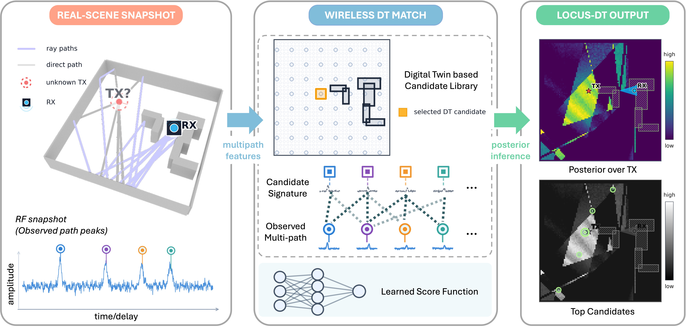

I lead a research line on RF localization that preserves competing spatial hypotheses instead of collapsing an ambiguous measurement into one coordinate. **MC-CLE** establishes the candidate-wise likelihood foundation; **LOCUS-DT** extends that idea by comparing an observed multipath snapshot with a ray-traced library of location hypotheses. Both methods produce spatial posteriors that can be calibrated, fused across views, and used by downstream autonomous systems.

## MC-CLE: learning candidate-wise likelihoods

MC-CLE asks a direct probabilistic question: for each candidate transmitter location, how compatible is the measured angle-and-strength signature with that state? The learned likelihood field retains multipath ambiguity, shadowing, and directional structure that a Gaussian point-error model cannot represent.

  <figure class="project-figure-card">
    
    <figcaption><strong>Journal schematic.</strong> The scene, receiver geometry, and RF channel signature condition a learned candidate scorer; normalizing those scores over space yields a full posterior rather than a single estimate.</figcaption>
  </figure>

  <figure class="project-figure-card">
    
    <figcaption><strong>Conference evidence.</strong> Across varied transmitter-receiver geometries, MC-CLE preserves directional and multimodal posterior structure that is smoothed away or geometrically constrained by Gaussian baselines.</figcaption>
  </figure>

The peer-reviewed [Asilomar 2026 paper](https://arxiv.org/abs/2509.25719) introduces likelihood-based full-posterior localization. The first- and corresponding-author journal extension, [*Learning a Measurement-to-Posterior Map for Wireless Localization*](/publications/lei2025-likelihoodposterior-wirelessloc/), is under review at **IEEE Transactions on Vehicular Technology (TVT)**.

## LOCUS-DT: conditioning on a wireless digital twin

LOCUS-DT makes the propagation model explicit. It extracts the observed multipath peaks, retrieves the corresponding path signatures for each candidate location from a wireless digital twin, and learns an observation-conditioned compatibility score. Normalizing the candidate scores produces a posterior over transmitter location, including multiple plausible modes when the evidence is incomplete.

  <figure class="project-figure-card">
    
    <figcaption><strong>Journal schematic.</strong> LOCUS-DT matches measured multipath features with candidate-specific ray-traced signatures, then converts learned compatibility scores into a calibrated spatial posterior.</figcaption>
  </figure>

  <figure class="project-figure-card">
    
    <figcaption><strong>Conference evidence.</strong> GLOBECOM experiments across three unseen indoor layouts show structured, often multimodal posteriors that reflect blockage and multipath instead of hiding them behind one coordinate.</figcaption>
  </figure>

The peer-reviewed [IEEE GLOBECOM 2026 paper](https://arxiv.org/abs/2608.00406) establishes LOCUS-DT. The journal extension, [*Site-Agnostic Posterior Inference for Indoor Localization with Ray-Tracing Wireless Digital Twins*](/publications/lei2026twc-siteagnostic-posterior/), studies generalization and explicit digital-twin mismatch; a revision is in preparation for resubmission to **IEEE Transactions on Wireless Communications (TWC)**.

## From posterior inference to autonomous systems

This foundation continues in [MAGNETAR](/projects/magnetar-joint-rf-pose-inference/), which expands the state from position to joint position-heading belief on the MobiFR3 physical platform, and in [MAPLE-RF](/projects/maple-rf-partial-map-localization/), which performs efficient posterior inference before a robot has finished mapping its environment. The common interface is the spatial belief: RF evidence becomes a calibrated distribution that can be fused, queried, and acted upon.
