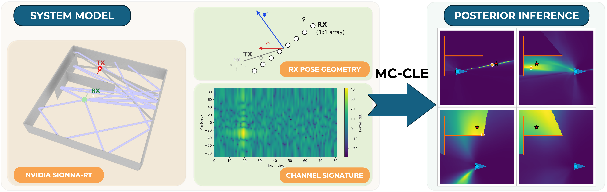
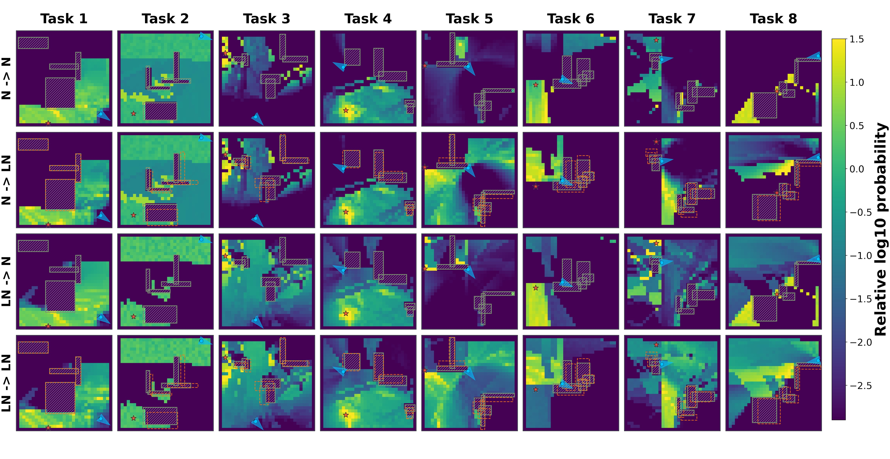

I develop posterior RF localization methods that preserve competing transmitter-location hypotheses instead of collapsing wireless observations into a single point estimate. This line includes **MC-CLE** for candidate-likelihood posterior inference and **LOCUS-DT**, which uses ray-tracing wireless digital twins as candidate-indexed multipath libraries for site-agnostic, layout-aware uncertainty scoring.

*MC-CLE uses the ray-tracing scene, receiver pose geometry, and channel signature to score candidate transmitter locations and produce a posterior belief map.*

*The LOCUS-DT heatmaps show how digital-twin likelihoods preserve multipath-driven spatial hypotheses, while simpler Gaussian baselines tend to smooth out the uncertainty structure.*

**Related papers**
- [Beyond Point Estimates: Likelihood-Based Full-Posterior Wireless Localization](https://arxiv.org/pdf/2509.25719) (Asilomar, under review; arXiv preprint)
- [Learning a Measurement-to-Posterior Map for Wireless Localization](/publications/lei2025-likelihoodposterior-wirelessloc/) (IEEE TSP, under review)
- [LOCUS-DT: Localization via Observation-Conditioned Uncertainty Scoring with Digital Twins](/publications/lei2026globecom-locusdt/) (IEEE GLOBECOM, under review)
- [Site-Agnostic Posterior Inference for Indoor Localization with Ray-Tracing Wireless Digital Twins](/publications/lei2026twc-siteagnostic-posterior/) (IEEE TWC, under review)
