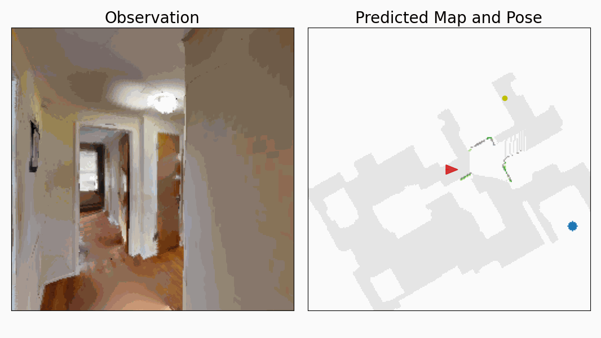

I co-developed ray-tracing wireless digital-twin and **PIRL** (physics-informed reinforcement learning) methods that use simulated propagation as a transferable prior for zero-shot indoor navigation. The robot's SLAM system supplies the map and robot pose; RF observations and physics-informed priors guide the search policy. This earlier work established the decision-making side of my current research on probabilistic RF localization and robotic sensing.

*This figure links posterior RF belief maps with indoor navigation, showing how uncertainty-aware localization can inform a search policy.*

<picture class="motion-aware-figure">
  <source media="(prefers-reduced-motion: reduce)" srcset="navigation_rollout_static.png">
  
</picture>

*The rollout animation shows a navigation policy using wireless belief maps as spatial guidance during indoor search.*

**Related papers**
- [Zero-Shot Wireless Indoor Navigation through Physics-Informed Reinforcement Learning (ICRA 2024)](https://par.nsf.gov/servlets/purl/10548847)
- [Digital Twin-Enhanced Wireless Indoor Navigation: Achieving Efficient Environment Sensing with Zero-Shot Reinforcement Learning (IEEE OJ-COMS 2025)](https://doi.org/10.1109/OJCOMS.2025.3552277)
- [Reinforcement Learning with Physics-Informed Symbolic Program Priors for Zero-Shot Wireless Indoor Navigation (RLC 2025 Spotlight)](https://openreview.net/pdf?id=w1Lg5cxCCU)
