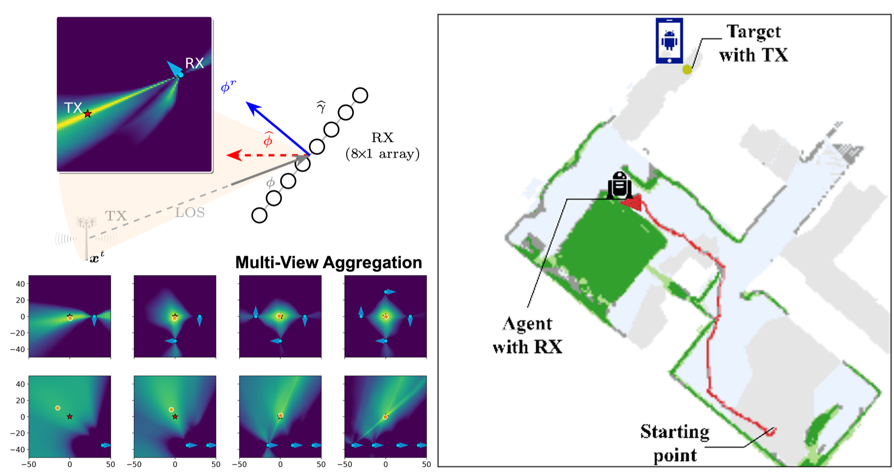

I develop ray-tracing wireless digital twins and **PIRL** (physics-informed reinforcement learning) methods that use simulated propagation as a transferable prior for zero-shot indoor navigation, wireless SLAM, and symbolic-prior robot policies. This line is being extended toward physical localization and navigation experiments with TurtleBot4 and Jackal UGV platforms, FR3 channel-sounding hardware, and controlled navigation scenarios.

*This figure links posterior RF belief maps with indoor navigation, showing how uncertainty-aware localization can support zero-shot wireless robot policies.*

**Related papers**
- [Zero-Shot Wireless Indoor Navigation through Physics-Informed Reinforcement Learning (ICRA 2024)](https://par.nsf.gov/servlets/purl/10548847)
- [Digital Twin-Enhanced Wireless Indoor Navigation: Achieving Efficient Environment Sensing with Zero-Shot Reinforcement Learning (IEEE OJ-COMS 2025)](https://doi.org/10.1109/OJCOMS.2025.3552277)
- [Reinforcement Learning with Physics-Informed Symbolic Program Priors for Zero-Shot Wireless Indoor Navigation (RLC 2025 Spotlight)](https://openreview.net/pdf?id=w1Lg5cxCCU)
