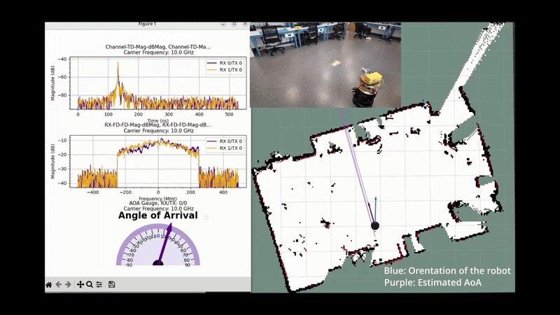
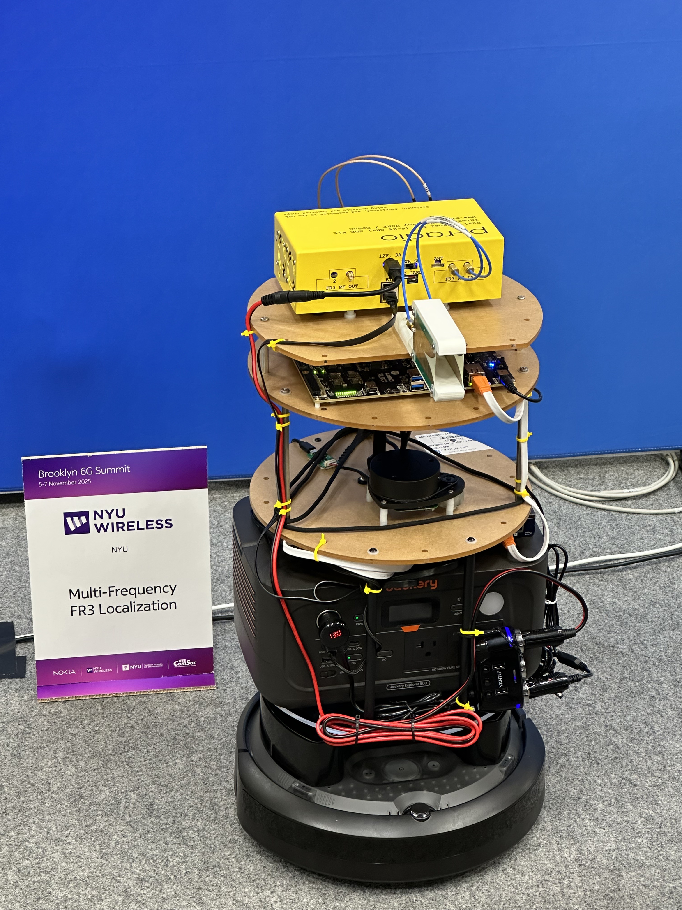

We built a TurtleBot4-based FR3 platform to run closed-loop localization and navigation experiments that integrate RF sensing with robotic autonomy.

**Related papers**
- [Zero-Shot Wireless Indoor Navigation through Physics-Informed Reinforcement Learning (ICRA 2024)](/uploads/papers/zeroshot-wireless-indoor-nav-icra2024.pdf)
- [Digital Twin-Enhanced Wireless Indoor Navigation (IEEE OJ-COMS 2025)](/uploads/papers/digital-twin-zeroshot-nav.pdf)

