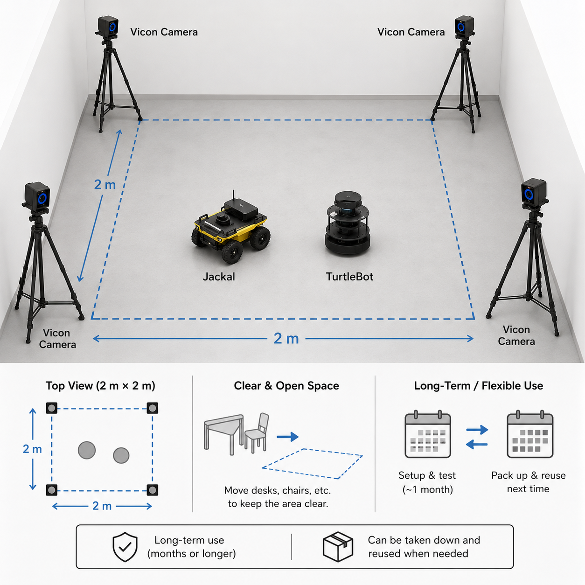
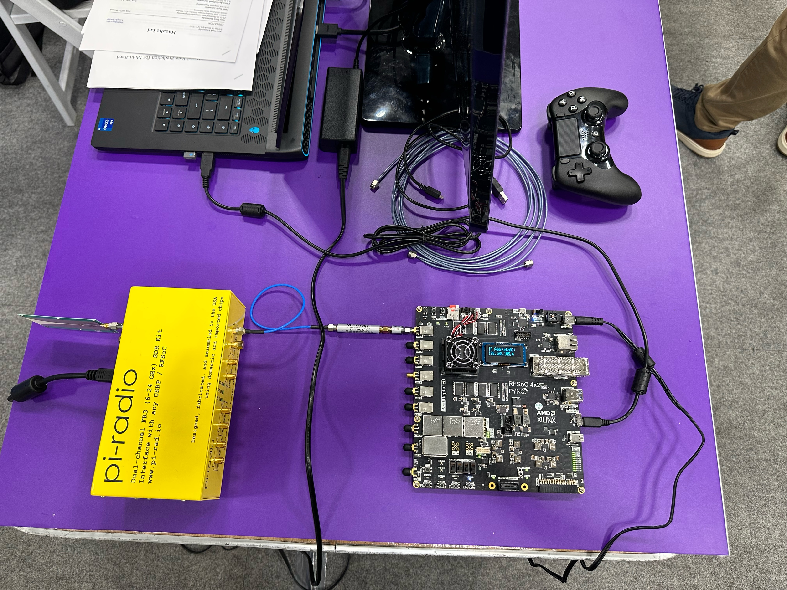

I am building and validating a 10-GHz FR3 robotic measurement platform for closed-loop localization and navigation experiments. The system combines Xilinx RFSoC 4×2 boards, Pi-Radio FR3 front ends, Vivaldi antennas, 2D LiDAR/RGB sensing, fixed and linear-track/D48 measurements, TurtleBot4 transmitter mobility, Jackal UGV receiver mobility, and Vicon ground truth under controlled LOS/NLOS transitions.

*The validation setup provides repeatable ground truth for robot motion and obstacle-induced LOS/NLOS experiments.*

*The demo shows the robotic measurement platform executing controlled motion while RF sensing data are collected.*

*This public demo shows the TurtleBot4-mounted FR3 hardware operating in a live measurement setting.*

**System capabilities**
- RFSoC transmit/receive waveform generation, capture, synchronization, channel estimation, SNR estimation, and AoA processing.
- Pi-Radio/Sivers front-end control, remote TCP/REST control, and synchronized physical metadata logging.
- Scripted TurtleBot4, linear-track, and D48 pan-tilt motion for reproducible measurement grids.
- Physical support for MC-CLE/LOCUS-DT posterior localization and wireless-aware navigation experiments.

*The hardware bench combines the Pi-Radio FR3 front end, RFSoC 4×2 baseband, Vivaldi antennas, and local compute/control equipment.*

*The hardware photo shows the deployed TurtleBot4 stack with the RF front end, compute, power, and control layers integrated on the robot.*
